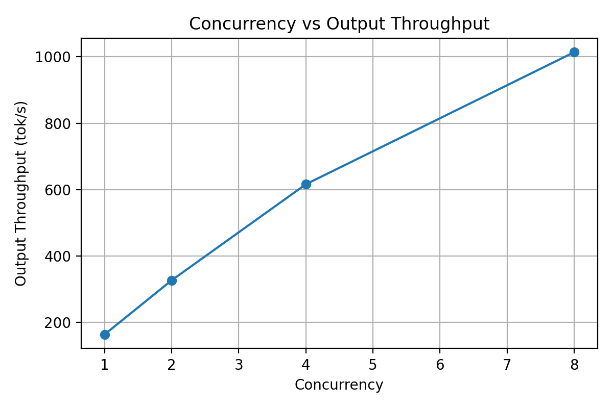
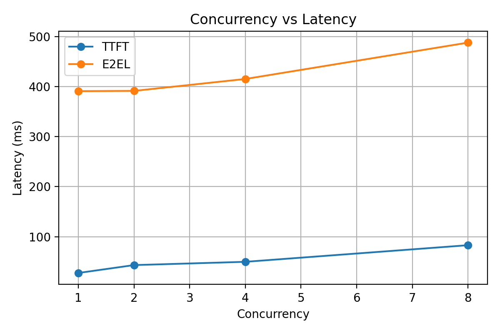
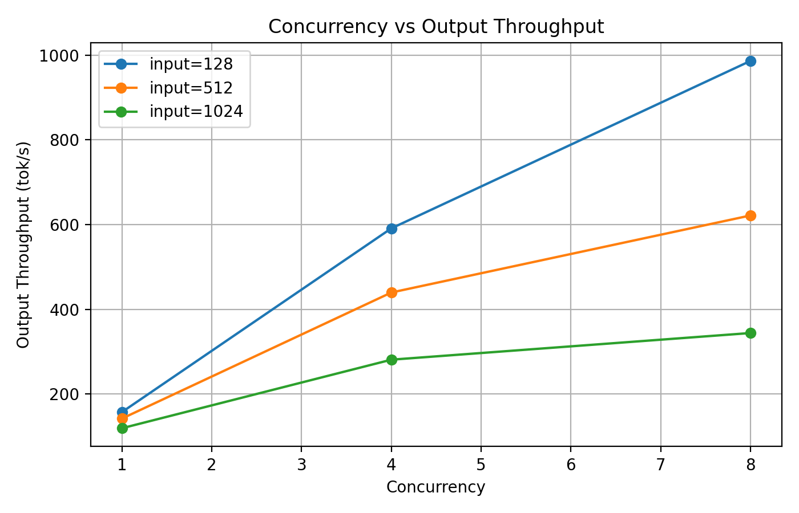
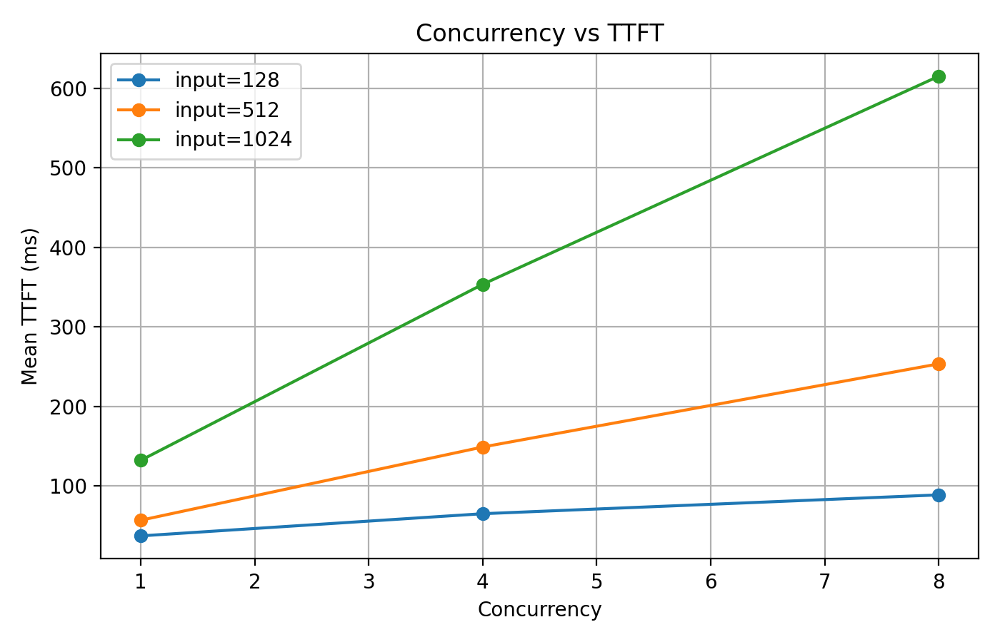
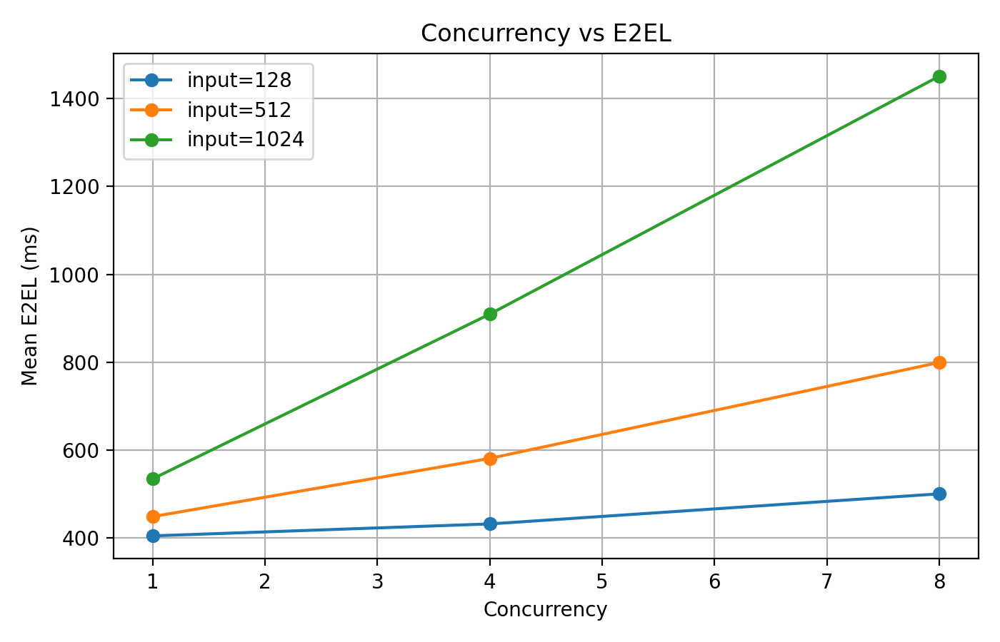

# LLM Inference Benchmark

通过实验学习和比较 LLM inference 的 latency、TTFT、TPOT、throughput，并逐步研究 Transformers 与 vLLM。

## Experiment 1: Input Length

实验目的：研究 input length 对 LLM inference latency 和 throughput 的影响。

实验设置：使用 `Qwen/Qwen2.5-0.5B-Instruct`，固定 `max_new_tokens=32`（同时设置 `min_new_tokens=32` 以固定输出长度），input length 分别为 64、128、256 和 512；每组 warm-up 1 次，正式运行 3 次。

| Input length (tokens) | Average latency (s) | Average throughput (tokens/s) |
| ---: | ---: | ---: |
| 64 | 1.4634 | 21.87 |
| 128 | 1.4958 | 21.39 |
| 256 | 1.5740 | 20.33 |
| 512 | 1.7464 | 18.32 |

随着 input length 增大，end-to-end latency 上升，throughput 下降。当前测量包含 Prefill 和 Decode，因此不能把 latency 增长直接解释为纯 Prefill latency；更长上下文也会增加 Decode 阶段的 context/KV Cache 开销。

## Experiment 2: Output Length

实验目的：研究 output length 对 LLM inference latency 和 throughput 的影响。

实验设置：使用 `Qwen/Qwen2.5-0.5B-Instruct`，固定 prompt length 为 128 tokens，output length 分别为 32、64、128 和 256；每组 warm-up 1 次，正式运行 3 次。

| Prompt length (tokens) | Output length (tokens) | Average latency (s) | Average throughput (tokens/s) |
| ---: | ---: | ---: | ---: |
| 128 | 32 | 1.6596 | 19.28 |
| 128 | 64 | 3.2534 | 19.69 |
| 128 | 128 | 6.4286 | 19.91 |
| 128 | 256 | 12.3965 | 20.67 |

随着 output length 增大，end-to-end latency 近似线性增加，因为 autoregressive decode 需要执行更多 sequential decode steps。Throughput 整体保持在约 19–21 tokens/s，没有随 output length 明显下降。较长输出中固定的 Prefill 开销被更多生成 token 摊薄，但当前只有 3 次 CPU 测试，不应对 throughput 的小幅变化做过度解释。

## Experiment 3: TTFT and TPOT

实验目的：分别观察首次生成延迟和后续 token 生成速度。

实验设置：使用 `Qwen/Qwen2.5-0.5B-Instruct`，prompt length 为 128 tokens，generated tokens 为 64；warm-up 1 次，正式运行 3 次。

| Run | TTFT (s) | TPOT (s/token) | Latency (s) |
| ---: | ---: | ---: | ---: |
| 1 | 0.1107 | 0.0445 | 2.9132 |
| 2 | 0.1169 | 0.0447 | 2.9304 |
| 3 | 0.1171 | 0.0444 | 2.9171 |
| **Average** | **0.1149** | **0.0445** | **2.9202** |

TTFT 表示从请求开始到第一个 generated token 出现的时间，但不能直接视为纯 Prefill latency。TPOT 表示第一个 token 之后，后续 token 的平均生成间隔。`TTFT + 63 × TPOT` 与总 latency 基本一致，说明当前 token-level 计时逻辑是自洽的。

## Experiment 4: Input Length vs TTFT/TPOT

实验目的：研究 input length 对 TTFT、TPOT 和 end-to-end latency 的影响。

实验设置：使用 `Qwen/Qwen2.5-0.5B-Instruct`，input length 分别为 64、128、256 和 512 tokens，固定生成 64 tokens；每组 warm-up 1 次，正式运行 3 次。

| Input length (tokens) | Average TTFT (s) | Average TPOT (s/token) | Average latency (s) |
| ---: | ---: | ---: | ---: |
| 64 | 0.0894 | 0.0487 | 3.1592 |
| 128 | 0.1314 | 0.0485 | 3.1895 |
| 256 | 0.1922 | 0.0498 | 3.3268 |
| 512 | 0.3502 | 0.0501 | 3.5058 |

随 input length 增大，TTFT 明显增加，说明长 prompt 会显著增加请求首次响应时间，但 TTFT 不能直接等同于纯 Prefill latency。TPOT 只轻微增加，当前范围内 Decode 每 token 的速度相对稳定；更长 context 会带来更大的 KV Cache 和更长的 attention context，因此 TPOT 仍可能受到影响，但不应过度解读 CPU 上的小幅差异。固定输出 64 tokens 后，总 latency 仍主要由 sequential Decode 时间构成。

## Experiment 5: Transformers GPU Baseline

实验环境：Google Colab，NVIDIA Tesla T4，PyTorch `2.13.0+cu130`，Transformers `5.17.0`。模型为 `Qwen/Qwen2.5-0.5B-Instruct`，运行在 `cuda:0`，使用 `torch.float16`；prompt length 为 128 tokens，固定生成 64 tokens，warm-up 3 次，正式运行 10 次。

| Metric | Average | Median |
| --- | ---: | ---: |
| Latency (s) | 2.2891 | 2.2063 |
| Throughput (tokens/s) | 28.09 | 29.01 |

Median 对偶发慢 run 不敏感，可以减小异常波动对典型性能判断的影响，因此与 average 一起报告。CPU 与 GPU 实验的硬件、运行环境和 dtype 不同，不应对两者的性能差异做过度解读或直接归因。

## Transformers vs vLLM: Single-request GPU Baseline

实验环境：Google Colab，NVIDIA Tesla T4，PyTorch `2.13.0+cu130`，Transformers `5.17.0`，vLLM `0.30.0`。两组测试均使用 `Qwen/Qwen2.5-0.5B-Instruct` 和 FP16，input length 为 128 tokens，output length 为 64 tokens，concurrency 为 1；warm-up 3 次，正式运行 10 次。vLLM 在 T4 上使用 `TRITON_ATTN` backend，而不是 FlashAttention 2。

| Backend | Average latency (s) | Median latency (s) | Average throughput (tokens/s) | Median throughput (tokens/s) |
| --- | ---: | ---: | ---: | ---: |
| Transformers | 2.2891 | 2.2063 | 28.09 | 29.01 |
| vLLM | 0.3677 | 0.3676 | 174.08 | 174.11 |

在这组相同 GPU、模型、input/output length 和 concurrency=1 的 workload 下，vLLM 显示出明显更低的 latency 和更高的 output-token throughput；该结果只描述当前实验条件，不代表 vLLM 在所有 workload 下都保持固定倍数的优势。表中数据是 warm-up 后的 steady-state 请求性能，vLLM 首次启动时的 engine initialization、compilation 和 CUDA graph capture 等冷启动开销未计入请求 latency。当前结果也仅代表 single-request performance，不代表高并发 serving 表现。

## vLLM Online Serving Concurrency Benchmark

本实验通过 vLLM OpenAI-compatible server 和 `vllm bench serve` 测量 online serving 的并发性能。此前的 single-request offline benchmark 直接调用 `LLM.generate`，测量单请求推理性能；本实验包含在线服务及客户端请求/响应路径，报告整组请求的 aggregate throughput 和每个请求的延迟。两次实验的 vLLM 版本也不同，因此不应将数值差异直接归因于并发变化。

实验环境：NVIDIA Tesla T4，PyTorch `2.13.0+cu130`，Transformers `5.17.0`，vLLM `0.31.0`，模型为 `Qwen/Qwen2.5-0.5B-Instruct`，使用 FP16。固定 input length = 128 tokens、output length = 64 tokens，concurrency 分别为 1、2、4、8；每组 warm-up 8 个请求，正式测量 100 个请求，prefix caching disabled。请求速率设为 `inf`，持续填满当前并发上限。

数据来自本次实验的 [summary.csv](results/vllm_online/t4_run_01/summary.csv)，并与同目录下四组 `concurrency_*.json` 核对一致。每组均完成 100 个请求、失败 0 个，实际输入/输出长度均为 128/64 tokens。

| Concurrency | Request throughput (req/s) | Output throughput (tok/s) | Mean TTFT (ms) | Mean TPOT (ms/token) | Mean E2EL (ms) |
| ---: | ---: | ---: | ---: | ---: | ---: |
| 1 | 2.556 | 163.58 | 27.45 | 5.766 | 390.73 |
| 2 | 5.106 | 326.78 | 43.20 | 5.524 | 391.22 |
| 4 | 9.624 | 615.93 | 49.73 | 5.799 | 415.05 |
| 8 | 15.841 | 1013.80 | 82.93 | 6.425 | 487.69 |

Output throughput 是所有请求合计的输出 token 速率。TTFT 为首 token 延迟，TPOT 为后续 token 的平均生成时间；E2EL 为客户端实际发出请求到接收完整响应的时间，不包含客户端等待并发信号量的排队时间。服务初始化、编译及 warm-up 不计入正式测量。

Concurrency 从 1 提高到 2 时，output throughput 从 163.58 增至 326.78 tok/s，几乎翻倍，而 mean E2EL 从 390.73 变为 391.22 ms，基本不变；不过 mean TTFT 已从 27.45 升至 43.20 ms。继续提高到 4、8 时，aggregate throughput 继续增长，但 TTFT 和 E2EL 均进一步上升。Concurrency=8 时，output throughput 约为 **1013.8 tok/s**，mean TTFT 为 82.93 ms，mean E2EL 为 487.69 ms，体现了 throughput–latency trade-off：更高并发提高整体处理能力，也增加单个请求的响应延迟。

这些结果反映 vLLM 整体 serving stack 的表现，不能将性能提升单独归因于 PagedAttention。Continuous batching、scheduler、KV cache management、optimized kernels 等共同影响并发服务性能；PagedAttention 与高并发下的 KV cache 管理密切相关，通过分页管理减少内存浪费并支持更多并发请求。本实验没有逐项关闭这些机制进行对照，因此无法量化各机制的独立贡献。

## vLLM Input Length × Concurrency Benchmark

实验环境：NVIDIA Tesla T4，PyTorch `2.13.0+cu130`，Transformers `5.17.0`，vLLM `0.31.0`，模型为 `Qwen/Qwen2.5-0.5B-Instruct`，FP16。Input length 为 128/512/1024 tokens，concurrency 为 1/4/8，output length 固定为 64 tokens；每组 warm-up 8 个请求、正式请求 100 个，prefix caching disabled。同一 server 实例完成九组，固定 `max-model-len=2048`、`max-num-seqs=8`、`max-num-batched-tokens=2048`；随机数据使用 seed=0、random-range-ratio=0、random-prefix-len=0、ignore-eos、temperature=0、request-rate=inf。

以下结果读取自 [summary.csv](results/vllm_online_input_concurrency/t4_run_01/summary.csv)，每组 completed=100、failed=0。运行和校验流程见 [实验文档](docs/vllm_online_input_concurrency.md)。

| Input length (tokens) | Concurrency | Request throughput (req/s) | Output throughput (tok/s) | Mean TTFT (ms) | Mean TPOT (ms/token) | Mean E2EL (ms) |
| ---: | ---: | ---: | ---: | ---: | ---: | ---: |
| 128 | 1 | 2.464 | 157.67 | 37.22 | 5.842 | 405.26 |
| 128 | 4 | 9.237 | 591.14 | 65.08 | 5.831 | 432.43 |
| 128 | 8 | 15.410 | 986.27 | 88.75 | 6.542 | 500.90 |
| 512 | 1 | 2.223 | 142.28 | 56.90 | 6.226 | 449.15 |
| 512 | 4 | 6.870 | 439.69 | 148.94 | 6.867 | 581.55 |
| 512 | 8 | 9.711 | 621.51 | 253.42 | 8.672 | 799.74 |
| 1024 | 1 | 1.866 | 119.43 | 132.20 | 6.395 | 535.11 |
| 1024 | 4 | 4.393 | 281.15 | 353.46 | 8.830 | 909.76 |
| 1024 | 8 | 5.376 | 344.06 | 614.95 | 13.269 | 1450.90 |

固定 input length 比较 concurrency：从 1 增至 8 时，128/512/1024 tokens 的 output throughput 分别提高约 **6.26/4.37/2.88 倍**；context 越长，并发带来的收益越弱。固定 concurrency 比较 input length：输入从 128 增至 1024 时，concurrency=1 的 mean E2EL 从 405.26 增至 535.11 ms，而 concurrency=8 从 500.90 增至 1450.90 ms，mean TTFT 也从 88.75 增至 614.95 ms，显示 input length 与 concurrency 存在明显交互。

Concurrency=1 时 TPOT 在 5.842–6.395 ms/token 范围内，较稳定；长 context 与高 concurrency 组合下明显上升，1024 tokens、concurrency=8 时达到 13.269 ms/token。这些现象与更高的 prefill cost、KV-cache footprint、attention memory traffic 和 serving resource pressure 一致，但这只是机制解释的假设，当前 benchmark 不能把性能变化单独归因于其中某一个因素，也不能单独归因于 PagedAttention。需要 profiling 和对照实验才能区分各机制的贡献。

## TODO

- [x] 开展 input length 实验
- [x] 开展 output length 实验
- [x] 开展 TTFT 和 TPOT 实验
- [x] 开展 input length 对 TTFT/TPOT 影响实验
- [x] 完成 Transformers GPU baseline
- [x] 开展 concurrency 实验
- [x] 开展 input length × concurrency 实验

## What I Learned

- Benchmark 需要固定 workload 和环境、预热、重复测量，并核验实际 token 数；GPU 计时还需正确同步。
- Offline 测试直接测量推理调用，online 测试覆盖请求、服务和响应路径，两者不能直接混用。
- TTFT 衡量首次响应，TPOT 衡量后续 token 的平均生成时间，E2EL 衡量完整响应延迟，throughput 衡量单位时间完成的请求或 tokens；TTFT 不等于纯 prefill 时间。
- Concurrency 是同时在途的请求数，batch size 是一次计算处理的样本或序列数；continuous batching 下两者不必相等。
- 提高并发体现 throughput–latency trade-off，context length 会改变并发扩展性。
- KV cache 保存 attention 所需的历史状态，PagedAttention 与其分页管理密切相关；serving 性能还取决于 continuous batching、scheduling 和 kernels。

## Limitations

- 只测试单一模型 `Qwen/Qwen2.5-0.5B-Instruct` 和单张 NVIDIA Tesla T4，输出固定为 64 tokens，在线 workload 使用随机输入。
- 当前二维实验只有一轮，每组仅 100 requests，缺少重复实验和置信区间，P99 稳定性有限。
- CPU/GPU、offline/online 实验的软件版本、硬件或调度配置不同，不能直接将跨实验差异归因于某一机制。
- 当前为饱和负载，E2EL 不包含客户端等待并发信号量的时间；没有使用 profiler 或机制消融，无法拆分 scheduler、KV cache、kernel 等机制的独立贡献。

## Next Steps

- 重复完整九组实验并轮换执行顺序，验证稳定性，报告波动和尾延迟。
- 开展 GPU profiling，分析计算、内存访问和调度瓶颈。
- 扩展到更长 context、更大模型和真实 prompts。
- 继续研究 KV cache、continuous batching 和 scheduling，并进行配置对照。
- 选择具体 inference optimization 工作，尝试复现其方法与性能结果。
